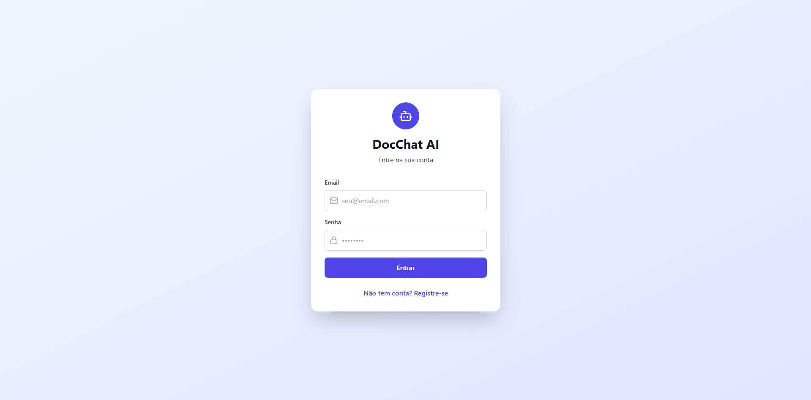
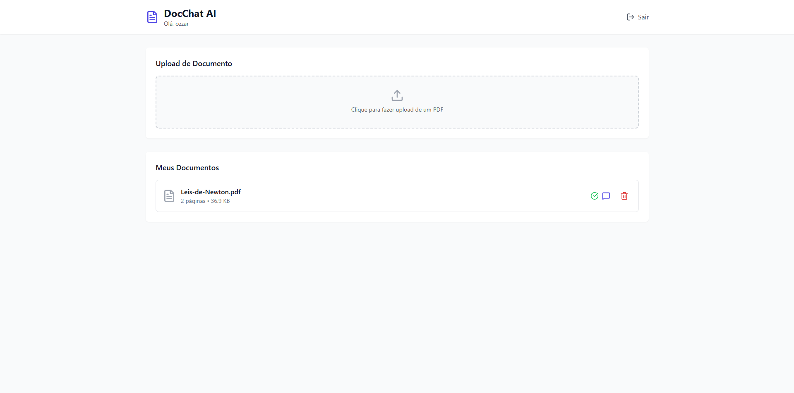
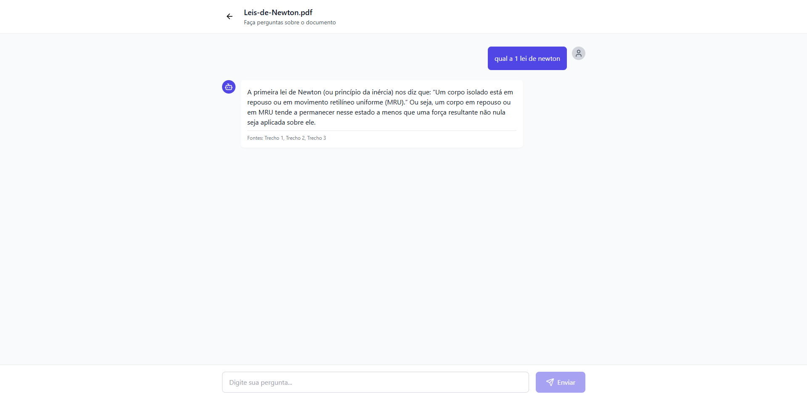

# DocChat AI 🤖📄

[](https://github.com/cezarnovaes/DocChat-AI/actions/workflows/ci.yml)
[](https://openjdk.org/)
[](https://spring.io/projects/spring-boot)
[](https://openai.com/)
[](LICENSE)

Chatbot inteligente que responde perguntas sobre seus documentos PDF usando Inteligência Artificial (RAG - Retrieval Augmented Generation).

## 🚀 Demo

**API em produção:** *Em breve*

**Interface Web:** *Em breve*

## ✨ Funcionalidades

- 📤 **Upload de PDFs**: Envie documentos e o sistema processa automaticamente
- 🤖 **Chat Inteligente**: Faça perguntas em linguagem natural sobre o conteúdo
- 🔍 **Busca Semântica**: Encontra as partes mais relevantes do documento para responder
- 🔐 **Autenticação JWT**: Sistema seguro com controle de acesso por usuário
- 📊 **Histórico**: Todas as conversas são salvas
- 🎯 **RAG (Retrieval Augmented Generation)**: Respostas baseadas APENAS no documento, evitando alucinações

## 🎥 Como Funciona
```
1. Usuário faz upload de um PDF
   ↓
2. Sistema extrai e divide o texto em chunks
   ↓
3. Gera embeddings (vetores) de cada chunk via OpenAI
   ↓
4. Armazena no banco de dados
   ↓
5. Usuário faz uma pergunta
   ↓
6. Sistema busca os chunks mais relevantes
   ↓
7. Envia contexto + pergunta para GPT-3.5
   ↓
8. Retorna resposta baseada no documento
```

## 🛠️ Tecnologias

### Backend
- **Java 21**
- **Spring Boot 3.2** (Web, Security, Data JPA)
- **PostgreSQL** (produção) / **H2** (desenvolvimento)
- **OpenAI API** (GPT-3.5 Turbo + Embeddings)
- **Apache PDFBox** (processamento de PDFs)
- **JWT** (autenticação)
- **Swagger/OpenAPI** (documentação)

### Frontend (em breve)
- **React 18**
- **TypeScript**
- **Tailwind CSS**
- **Axios**

### DevOps
- **Docker**
- **GitHub Actions** (CI/CD)
- **Render** (deploy)

## 📁 Estrutura do Projeto
```
DocChat-AI/
├── backend/                    # API Spring Boot
│   ├── src/
│   │   ├── main/
│   │   │   ├── java/com/cezar/docchat/
│   │   │   │   ├── config/        # Security, Swagger, CORS
│   │   │   │   ├── controller/    # Endpoints REST
│   │   │   │   ├── dto/           # Data Transfer Objects
│   │   │   │   ├── model/         # Entidades JPA
│   │   │   │   ├── repository/    # Acesso ao banco
│   │   │   │   └── service/       # Lógica de negócio + OpenAI
│   │   │   └── resources/
│   │   └── test/
│   ├── pom.xml
│   └── Dockerfile
├── frontend/                   # (em breve) React
├── docs/
└── README.md
```

## 📸 Screenshots

### Tela de Login


### Dashboard


### Chat Interativo


## 🏃 Como Executar Localmente

### Pré-requisitos
- Java 21+
- Maven 3.8+
- Conta OpenAI (API Key)

### Backend
```bash
# Clone o repositório
git clone https://github.com/cezarnovaes/DocChat-AI.git
cd DocChat-AI/backend

# Configure sua API Key da OpenAI
# Edite: src/main/resources/application-dev.properties
openai.api.key=sk-sua-chave-aqui

# Execute
./mvnw spring-boot:run

# Ou no Windows
mvnw.cmd spring-boot:run
```

A API estará disponível em: `http://localhost:8080`

### Acessar Swagger UI
```
http://localhost:8080/swagger-ui.html
```

### H2 Console (Desenvolvimento)
```
http://localhost:8080/h2-console

JDBC URL: jdbc:h2:mem:docchatdb
User: sa
Password: (vazio)
```

## 📚 Documentação da API

### Autenticação

#### Registrar usuário
```bash
POST /api/auth/register
Content-Type: application/json

{
  "name": "Seu Nome",
  "email": "seu@email.com",
  "password": "senha123"
}

# Resposta (201 Created)
{
  "token": "eyJhbGciOiJIUzI1NiJ9...",
  "type": "Bearer",
  "user": {
    "id": 1,
    "name": "Seu Nome",
    "email": "seu@email.com",
    "createdAt": "2025-11-23T10:00:00"
  }
}
```

#### Login
```bash
POST /api/auth/login
Content-Type: application/json

{
  "email": "seu@email.com",
  "password": "senha123"
}
```

### Documentos

#### Upload de PDF
```bash
POST /api/documents
Authorization: Bearer {seu-token}
Content-Type: multipart/form-data

file: arquivo.pdf

# Resposta (201 Created)
{
  "id": 1,
  "filename": "uuid-random.pdf",
  "originalFilename": "arquivo.pdf",
  "fileSize": 125000,
  "pageCount": 5,
  "status": "READY",
  "createdAt": "2025-11-23T10:00:00",
  "processedAt": "2025-11-23T10:00:05"
}
```

#### Listar documentos
```bash
GET /api/documents?page=0&size=10
Authorization: Bearer {seu-token}
```

#### Deletar documento
```bash
DELETE /api/documents/{id}
Authorization: Bearer {seu-token}
```

### Chat

#### Fazer pergunta sobre documento
```bash
POST /api/chat
Authorization: Bearer {seu-token}
Content-Type: application/json

{
  "documentId": 1,
  "message": "Qual o tema principal deste documento?"
}

# Resposta (200 OK)
{
  "answer": "O tema principal do documento é...",
  "sources": ["Trecho 1", "Trecho 2", "Trecho 3"],
  "timestamp": "2025-11-23T10:01:00"
}
```

## 🧪 Testes
```bash
cd backend

# Executar testes
./mvnw test

# Com cobertura
./mvnw test jacoco:report
```

Relatório: `backend/target/site/jacoco/index.html`

## 🐳 Docker
```bash
# Build
docker build -t docchat-api ./backend

# Run
docker run -p 8080:8080 \
  -e OPENAI_API_KEY=sk-sua-chave \
  -e DATABASE_URL=jdbc:postgresql://host/db \
  docchat-api
```

## 🚀 Deploy

### Render (Gratuito)

1. Conecte seu repositório GitHub ao Render
2. Configure as variáveis de ambiente:
   - `OPENAI_API_KEY`
   - `DATABASE_URL` (PostgreSQL)
   - `JWT_SECRET`
   - `SPRING_PROFILES_ACTIVE=prod`
3. Deploy automático a cada push na `main`

## 🎯 Roadmap

- [x] Autenticação JWT
- [x] Upload e processamento de PDFs
- [x] Chat com OpenAI (RAG básico)
- [x] Frontend React interativo
- [x] Swagger/OpenAPI
- [x] CI/CD com GitHub Actions

## 🧠 Como Funciona o RAG

**RAG (Retrieval Augmented Generation)** é uma técnica que combina busca de informações com geração de texto:

1. **Indexação**: Documento é dividido em chunks e cada chunk vira um vetor (embedding)
2. **Busca**: Pergunta do usuário vira um vetor e buscamos os chunks mais similares
3. **Geração**: Chunks relevantes + pergunta são enviados para o LLM gerar resposta

**Vantagens:**
- Respostas baseadas em dados reais (não alucina)
- Atualização fácil (adicione novo documento)
- Citação de fontes

## 🤝 Contribuindo

1. Fork o projeto
2. Crie sua branch (`git checkout -b feature/nova-feature`)
3. Commit suas mudanças (`git commit -m 'Add: nova feature'`)
4. Push para a branch (`git push origin feature/nova-feature`)
5. Abra um Pull Request

## 📝 Licença

Este projeto está sob a licença MIT. Veja o arquivo [LICENSE](LICENSE) para mais detalhes.

## 👤 Autor

**Cézar Novaes**

- GitHub: [@cezarnovaes](https://github.com/cezarnovaes)
- LinkedIn: [Cézar Novaes](https://linkedin.com/in/cezar-novaes-12a898193/)
- Email: cezarnovaes14@gmail.com

---

⭐ Se este projeto te ajudou, considere dar uma estrela!

## 📖 Recursos e Referências

- [OpenAI API Documentation](https://platform.openai.com/docs)
- [Spring Boot Documentation](https://spring.io/projects/spring-boot)
- [RAG Explained](https://www.pinecone.io/learn/retrieval-augmented-generation/)
- [LangChain Conceptual Guide](https://python.langchain.com/docs/concepts/)